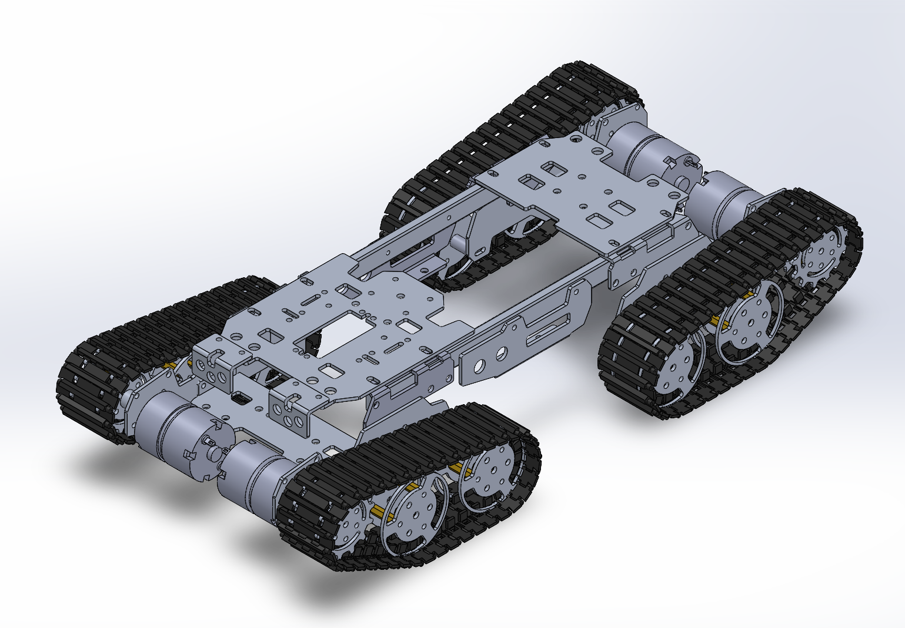
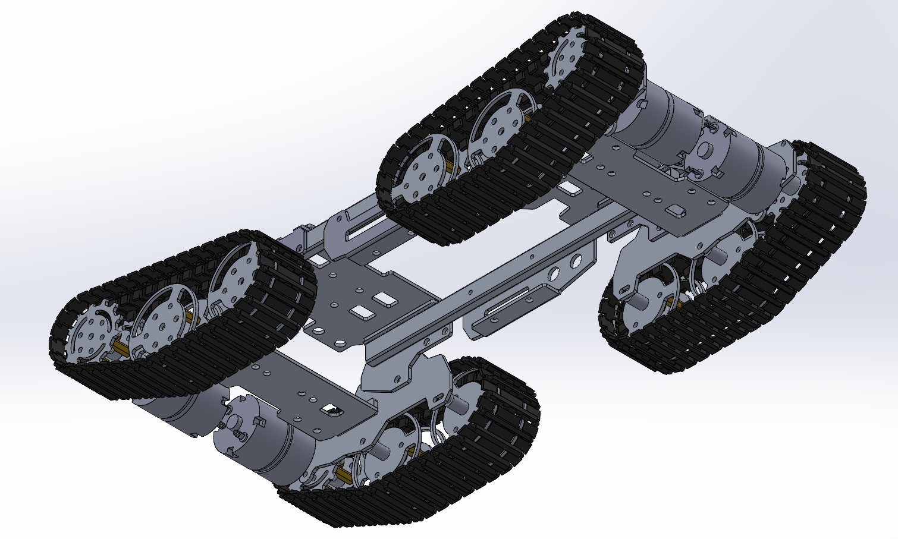
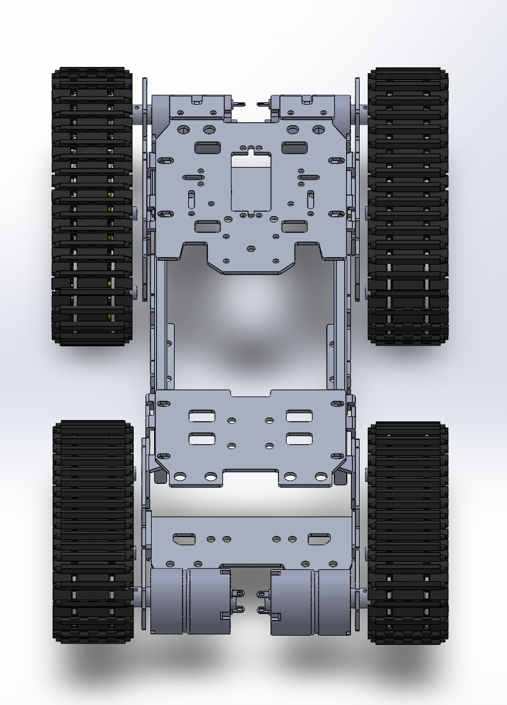

<!-- TEAM LOGO PLACEHOLDER: replace with actual logo path -->

# Underground Mine Safety & Rescue Rover : Mechanical Chassis

<p align="center">
  
  
  
  
  
</p>

<p align="center">
  <strong>Mechanical Chassis · CAD Development · SIH 2026</strong>
</p>

Mechanical chassis and structural CAD for a four-track ground rover, developed for Smart India Hackathon Problem Statement 26039 — *AI-Powered Underground Mine Safety, Monitoring and Rescue System* (Government of Jharkhand, Department of Higher & Technical Education).

> [!IMPORTANT]
> This repository currently focuses exclusively on the mechanical chassis and CAD architecture of the rover. Sensing, communication, power, and software subsystems are in the different repository.

---

## Table of Contents
- [Project Context](#project-context)
- [Current Scope](#current-scope)
- [Chassis Design Overview](#chassis-design-overview)
- [Mechanical Design Intent](#mechanical-design-intent)
- [CAD Preview](#cad-preview)
- [Design Highlights](#design-highlights)
- [CAD Assets](#cad-assets)
- [Dimensions & Specifications](#dimensions--specifications)
- [Design Status](#design-status)
- [Revision History](#revision-history)
- [Future Integration](#future-integration)
- [Repository Philosophy](#repository-philosophy)
- [Jury / Presentation Snapshot](#jury--presentation-snapshot)
- [License](#license)

---

## Project Context

SIH PS 26039 calls for a rover to support exploration to inaccessible areas, situational awareness, and rescue operations inside hazardous coal mines lose rubble, uneven floors, terrains, confined access, low visibility. Any sensing or autonomy layer depends on a mechanical platform that can physically move through that terrain. This repository documents that platform.

---

## Current Scope

| In Scope (this repo) | Out of Scope (future) |
|:---|:---|
| Chassis frame parts | AI / perception software |
| Full drivetrain component set | Gas / thermal / vision sensors |
| Track, sprocket, wheel, motor geometry | Communication & telemetry |
| Preview renders | Power electronics, battery management |
| CAD-level documentation | Autonomous navigation, SLAM |

---

## Chassis Design Overview

The platform is a **four-track (quad-tracked) rover**. The full part set confirms a symmetric, per-corner drivetrain built on a ladder-style frame:

**Frame** — `Front_chassis_main_plate` and `Rear_chassis_main_plate` form the two main structural plates. `long_side_rail_L/R` run the length of the chassis connecting them, with `Side_sub_rail` and `Side_sub_rail_Right_side` as a secondary L/R rail pair, and `Bottom_sub_chassis` forming a lower structural plate. `intermediate_chassis_hldr_L/R` sit between the front and rear plate groups — consistent with the jointed linkage visible in the isometric renders, where the front and rear track-pairs appear to connect through a pivot rather than a single rigid span.

**Drivetrain (per corner, ×4)** — Each track loop runs on `sprocket_wheel_big_cent` (main drive sprocket) and `sprocket_wheel_complx` (idler sprocket), supported underneath by `wheel_big_cmplx` and `wheel_big_simple` road wheels, with `single_tread_piece` links arrayed into the belt. Each unit is driven by an `SN1300_dc_motor`, carried on a `motor_suspen_mount` — the name indicates a suspension provision at the motor mount, i.e. some shock/vibration isolation, though the mount's exact compliance mechanism isn't determinable from the part in isolation. `Drive_shaft` connects motor output to the sprocket. `bronze_wheel_spacer` and `nylon_spacer_bearing` are axle-level spacer/bearing components — named to indicate bronze and nylon respectively; this is the part name, not a confirmed material property, since no material metadata could be extracted from the CAD files.

**Fasteners/misc** — `Small_L_bracket` is a secondary mounting bracket used in the frame or motor-mounting area.

---

## Mechanical Design Intent

**Structural Packaging** — A ladder frame carries four independent track-and-motor units plus their spacers/shafts within one compact platform.

**Subsystem Mounting** — Front and rear main plates carry cutouts and hole patterns consistent with future equipment mounting; specific mount assignments aren't documented yet.

**Suspension / Compliance** — The presence of `motor_suspen_mount` indicates the motor mounting is not fully rigid — some isolation or float is designed in. The nature and travel of that compliance isn't specified in the current parts.

**Articulation** — `intermediate_chassis_hldr_L/R` linking front and rear plate groups, combined with the jointed appearance in the renders, is consistent with a passive rocker-style articulation for terrain-following. This remains a visual/part-name-based interpretation — no assembly mates or motion study were provided to confirm degrees of freedom.

**Underground Environment Considerations** — A four-track, independently-driven layout is generally suited to loose or uneven ground of the kind the SIH problem describes. The chassis is being designed with that context in mind.


---

## CAD Preview

<p align="center">
  
</p>

<p align="center">
  
  
</p>

---

## Design Highlights

| Feature | Chassis Implementation |
|:---|:---|
| Drive Configuration | Four independent tracked drive units |
| Track Mechanism | Center + idler sprocket, dual road-wheel types, linked tread |
| Motor Mounting | Suspension-type mount per motor (`motor_suspen_mount`) |
| Frame Type | Ladder frame: front/rear plates + dual rail pairs + intermediate holders |
| Articulation | Front/rear linkage visible; not kinematically confirmed |
| Bearings/Spacers | Bronze and nylon components at wheel axles (per part naming) |
| CAD Platform | SolidWorks (native `.SLDPRT`, 19 parts) |

---

## CAD Assets

| Part | Format | Category |
|:---|:---|:---|
| `Front_chassis_main_plate` | `.SLDPRT` | Frame |
| `Rear_chassis_main_plate` | `.SLDPRT` | Frame |
| `Bottom_sub_chassis` | `.SLDPRT` | Frame |
| `long_side_rail_L` | `.SLDPRT` | Frame |
| `long_side_rail_R` | `.SLDPRT` | Frame |
| `Side_sub_rail` | `.SLDPRT` | Frame |
| `Side_sub_rail_Right_side` | `.SLDPRT` | Frame |
| `intermediate_chassis_hldr_L` | `.SLDPRT` | Frame |
| `intermediate_chassis_hldr_R` | `.SLDPRT` | Frame |
| `Small_L_bracket` | `.SLDPRT` | Frame / mounting |
| `SN1300_dc_motor` | `.SLDPRT` | Drivetrain |
| `motor_suspen_mount` | `.SLDPRT` | Drivetrain |
| `Drive_shaft` | `.SLDPRT` | Drivetrain |
| `sprocket_wheel_big_cent` | `.SLDPRT` | Drivetrain |
| `sprocket_wheel_complx` | `.SLDPRT` | Drivetrain |
| `wheel_big_cmplx` | `.SLDPRT` | Drivetrain |
| `wheel_big_simple` | `.SLDPRT` | Drivetrain |
| `single_tread_piece` | `.SLDPRT` | Drivetrain |
| `bronze_wheel_spacer` | `.SLDPRT` | Drivetrain |
| `nylon_spacer_bearing` | `.SLDPRT` | Drivetrain |

> [!NOTE]
> No `.SLDASM` assembly, `.SLDDRW` drawing, or neutral export (STEP/STL) is included yet.

---

## Dimensions & Specifications

| Parameter | Value |
|:---|:---|
| Overall length / width / height | Not specified in current CAD release |
| Track gauge / wheelbase | Not specified in current CAD release |
| Mass | Not specified in current CAD release |
| Material(s) | Not specified in current CAD release |
| Motor specification | Not specified in current CAD release |

---

## Design Status

```text
Current Status
────────────────────────────────
CAD Modeling           : Complete — 19 unique parts across frame + drivetrain
Assembly Documentation : Not yet added
Drawings               : Not documented
Fabrication            : Not documented
Physical Validation    : Not documented
```

---

## Revision History

> Revision history will be maintained as the chassis design evolves. No prior revisions are currently tracked. Detailed release notes are tracked in [CHANGELOG.md](Revision-History/CHANGELOG.md).

---

## Future Integration

The following are future integration areas, not implemented in this repository: environmental sensing, communication/telemetry, power and battery management, control electronics and motor-control software, navigation/autonomy, rescue-support tooling.

---

## Repository Philosophy

Organized to preserve CAD traceability, support revision control as the design matures, and leave clear structure for the assembly, drawings, and exports that follow.

---

## Jury / Presentation Snapshot

**Complete Per-Corner Drivetrain** — Every track unit has its own motor, sprocket set, wheels, and suspension mount.

**Terrain-Oriented Platform** — Four independent tracks over wheels, suited to uneven mine terrain.

**Articulated Frame Concept** — Intermediate holders link front and rear sections for terrain-following.

**Full CAD Traceability** — All 19 structural and drivetrain parts modeled natively in SolidWorks.

**Transparent Scope** — Chassis-only repository; sensing/software details are in different repository.

---

## License

Not yet specified
